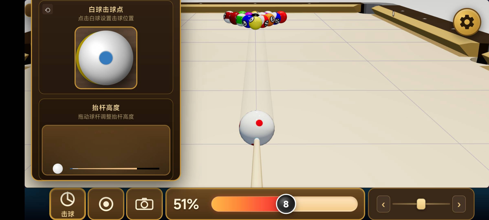
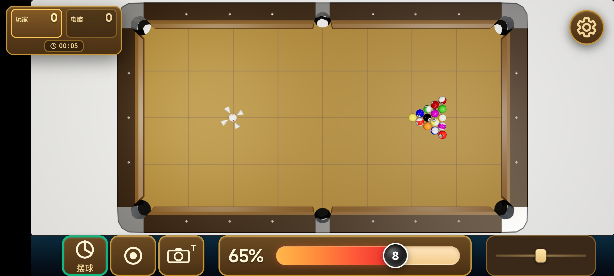
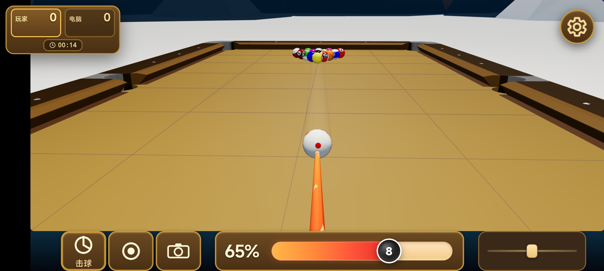

# 奥特曼的台球 · 中文离线版

<p align="center"><b>中文</b> | <a href="README.en.md"><b>English</b></a></p>

[](https://www.gnu.org/licenses/gpl-3.0)
[](#下载)
[](#隐私)

一个全中文、无广告的安卓台球游戏。基于 three.js 的真实物理引擎，内置本地 AI 对手，单机完全离线可玩；v1.3.65 起可选**局域网对战**（同 WiFi/局域网直连），仅申请一个 `INTERNET` 权限且不发任何外部网络请求。

<p align="center">
  
</p>
<p align="center"><em>主菜单：模式选择、对手难度、外观定制</em></p>

<p align="center">
  
  
</p>
<p align="center"><em>安卓端游戏界面：俯视视角（左）与击球视角（右）</em></p>

> **修改声明**
> 本作品是开源项目 [tailuge/billiards](https://github.com/tailuge/billiards) 的**衍生作品**，
> 由该项目修改而来，修改日期 **2026 年 8 月 3 日**。
> 原项目版权归 tailuge 及其贡献者所有，依 GNU GPL v3.0 授权。
> 本衍生作品同样依 **GPL-3.0** 发布。

---

## 下载

**在线发布页**：<https://a8bf01e5f1e8b47ce.bj9.agentos-app.net/>

无需安装即可在浏览器中**在线试玩**，也可以直接在该页面下载最新版 APK。

前往 [Releases](../../releases/latest) 也可下载最新版 APK。

安装说明与常见问题见 [`docs/安装与使用说明.md`](docs/安装与使用说明.md)。

---

## 特性

| | |
|---|---|
| **纯单机 / 局域网对战** | 默认单机离线，可选局域网对战；全程无外网请求、无账号、无广告、无内购、无统计上报 |
| **极简权限** | `AndroidManifest.xml` 仅声明一个 `INTERNET`（局域网对战专用，纯本机 TCP，不发外部请求），无存储/位置/电话/相机等任何权限，可用 `aapt2 dump badging` 自行验证 |
| **全中文** | 菜单、玩法、设置、犯规提示、结算文案全部汉化 |
| **真实物理** | 继承原项目的球体碰撞、旋转（塞）、库边反弹与摩擦模型 |
| **本地 AI** | 两档难度对手（稳健 / 激进），全程本地计算 |
| **画质可调** | 六档 LOD 画质系统，自动检测设备性能，低端机也能跑顺 |
| **玩法** | 九球、斯诺克、开伦、练习模式 |

---

## 引用与致谢

| 项目 | [tailuge/billiards](https://github.com/tailuge/billiards) |
|---|---|
| 作者 | tailuge |
| 协议 | GNU General Public License v3.0 |
| 基线版本 | 0.3.1 |

本项目的**物理引擎、渲染管线、规则判定、本地 AI 对手**等核心实现全部来自上述原始项目。
真实的球体碰撞、旋转、库边反弹与摩擦模型均为原作者的成果。在此向 tailuge 及所有贡献者致谢。

完整的开源声明、修改清单与第三方组件列表见 [`开源声明.md`](开源声明.md)。

---

## 主要改动

**中文本地化** — 菜单、玩法说明、设置、操作介绍、击球按钮、得分板、犯规原因、
胜负结算及斯诺克彩球名称全部汉化；新增集中式文案模块 `src/utils/i18n.ts`。

**移除联网功能** — 移除 WebSocket 多人大厅与消息中继（含 `@tailuge/messaging` 依赖）、
分数上传、遥测统计、崩溃上报、Google Fonts 外链、分享外链、局面图导出、在线分析面板。
v1.3.65 起重新加入**局域网对战**（见下「安卓封装」），但仅限同一局域网/直连，不发任何外部请求。

**移动端适配** — 新增六档 LOD 画质系统（渲染分辨率 / 抗锯齿 / 球体几何精度）、
设备性能自动检测、刘海屏安全区域适配、横屏布局优化、进球与碰撞震动反馈。

**新增功能** — 中文主菜单、内置操作介绍页、内置游戏设置面板（菜单与游戏内实时同步）、
应用内开源许可与致谢页、局域网对战。

**安卓封装** — Android WebView 原生外壳，仅声明一个 `INTERNET` 权限（局域网对战专用：
进程内监听 TCP 端口并连接对方手机，纯本机直连，不向任何外部服务器发起请求；在线功能保持下线）。

---

## 隐私

这个应用不向任何外部服务器发送数据，也不会收集任何信息：

- `INTERNET` 权限仅用于**局域网对战**：进程内监听 TCP 端口并连接对方手机，纯本机直连、不发任何外网请求；不开启局域对战时不建立任何连接
- 无存储、位置、电话、相机等任何权限
- 所有资源（three.js、模型、音效）均打包在 APK 内，运行时零外链
- 无账号、无统计上报、无广告 SDK

单机游玩全程无网络请求，即便开启飞行模式也完全可玩（局域网对战需双方连在同一 WiFi/局域网）。

---

## 目录结构

```
billiards-cn/          游戏本体
  src/                 TypeScript 源码
  dist/                构建产物（可直接用浏览器打开 menu.html 试玩）
  webpack.config.js    打包配置
  LICENSE              GPL-3.0 协议全文

billiards-apk/         安卓封装
  AndroidManifest.xml  应用清单（仅 INTERNET：局域网对战）
  src/                 MainActivity.java
  res/                 图标与字符串资源
  build-apk.sh         一键构建脚本

docs/                  安装说明与发布说明
开源声明.md             GPL-3.0 衍生声明与第三方组件清单
```

---

## 构建

### 前端

```bash
cd billiards-cn
yarn install
node_modules/.bin/tsc --noEmit      # 类型检查
node_modules/.bin/webpack           # 打包到 dist/
```

产物为 `dist/` 下的 `index.js`、`three_core.js`、`three_module.js`、`three_examples.js`。
直接用浏览器打开 `dist/menu.html` 即可试玩，不需要起服务器。

### 安卓 APK

不依赖 Gradle，使用 Android SDK 底层工具链。需要 `platforms/android-34`、`build-tools/34.0.0` 和 JDK：

```bash
export ANDROID_SDK=/path/to/android-sdk
cd billiards-apk
./build-apk.sh
```

脚本依次执行 `aapt2 compile` → `aapt2 link` → `javac` → `d8` → `zipalign` → `apksigner`，
最后自动校验签名并打印权限清单（应仅为 `INTERNET` 或空）。若目录下没有 `release.keystore`，脚本会自动生成一个自签名调试密钥。

> **构建陷阱**：`aapt2 link` 必须显式传 `--min-sdk-version 21 --target-sdk-version 34`。
> 否则 aapt2 会按旧版兼容规则**隐式追加** `WRITE_EXTERNAL_STORAGE`、`READ_PHONE_STATE`、
> `READ_EXTERNAL_STORAGE` 三个权限，极简权限的承诺就破功了。

---

## 协议

本作品依据 **GNU General Public License v3.0** 发布，与原始项目保持一致。
协议全文见 [`LICENSE`](LICENSE)，或访问 <https://www.gnu.org/licenses/gpl-3.0.html>。

你有权自由运行、研究、修改和再分发本作品，但再分发时须遵循同样的 GPL-3.0 条款，
并须提供对应的完整源代码。

本程序不提供任何担保，使用风险由你自行承担。
